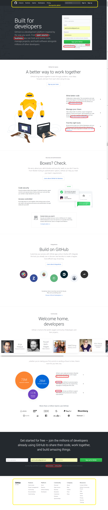
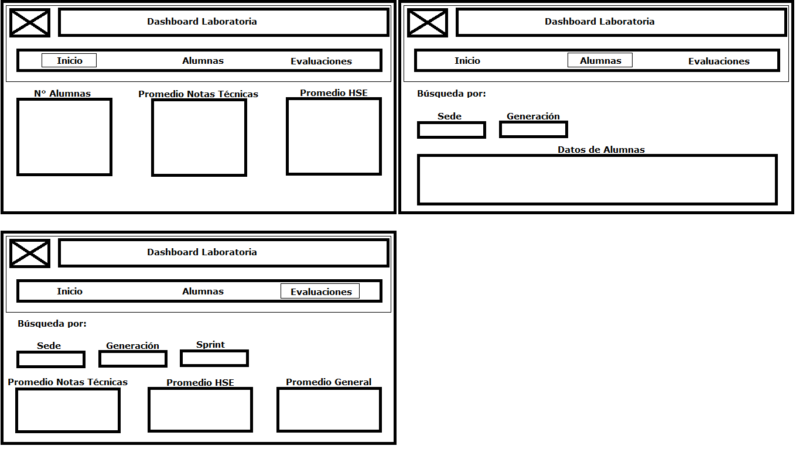

# Ejercicio 1.

Descripción: De la página web de Laboratoria, explica qué partes conforman el UX y qué partes el UI.

## UX

- Los elementos marcados con color rojos corresponden a UX ya que estan enfocados a transmitir emociones e información, lo que puede ayudar a atraer mas postulantes.

## UI

- Los elementos marcados con color azul corresponden a UI, ya que son elementos que tienen alguna funcionalidad, como los son:botones, links, enlaces a redes sociales, y enlaces a otras partes de la página.

# Ejercicio 2.

Descripción: De la página web de Github, identificar los elementos de navegación.

- Los elementos marcados con color amarillo corresponden a la navegación global, ya que estos aparecen en todas las vistas y se pueden explorar las opciones de la página web.

- Los elementos marcados con color rojo son de navegación en línea por ser links de referencia.

- Todos lo demás elementos corresponde a una navegación local, ya que que sólo aparecen en la vista actual de la página web.

# Ejercicio 3.

Descripción: Crea un sketch para la herramienta del dashboard de Laboratoria.

- Se tiene un sketch que cuenta con tres módulos (Inicio ,Alumnas y Evaluaciones).
    - El módulo de Inicio es donde se mostraran las estadísticas generales como lo son el número de alumnas y el porcentaje que alcanza el criterio mínimo de evaluación, además del promedio de notas técnicas y HSE.
    - El módulo Alumnas, permitirá hacer una búsqueda para mostrar los datos de alumnas por sede y/o generación.  
    - El módulo de Evaluaciones, permitirá revisar el promedio de evaluaciones técnicas, HSE y general. De acuerdo al criterio de búsqueda (sede, generación, sprint).

    
